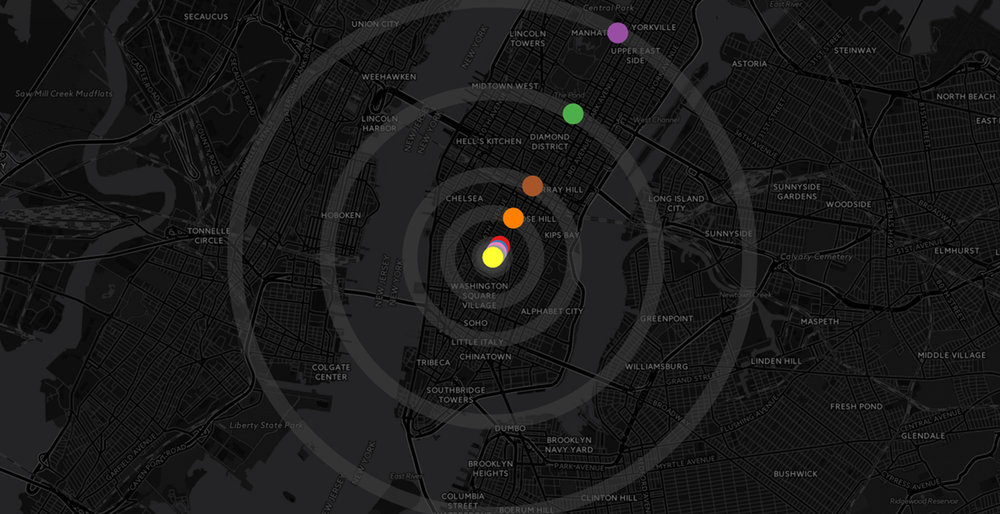

# wave9
##### wave9 is an augemented reality mobile application that allows audiences to experience an immersive model of teh solar system set against the backdrop of Manhattan's Fifth Avenue.
#####  
##### [wave9 presentation site](http://moriartp.github.io/projects/wave_9/)
Commonly, numerical values expressed in multiple orders of magnitude are difficult to comprehend, particularly so for audiences that are less-mathematically inclined. The deliverable of this project is intended to narrow this gap in comprehension in order to create meaning and make interpretable a true model of the solar system to a general audience. Owing to early visual representations of the the sublime in 19th century romanticism, the project name, in homage to Russian Armenian painter Ivan Aivazovsky, is dubbed, Wave 9.

Using the physical landscape of Manhattan, as its backdrop, the wave 9 mobile application guides audiences on a walking tour through a physical model of the solar system that begins at Parsons campus in dowtown New York and stretches up Fifth Avenue to the Metropolitan Museum of art, where the model concludes. Along the way, guided the applications map, audiences encounter various markers which trigger 3D renderings within the mobile app visualizing the various planets of our solar system using augmented reality technology.

The three dimensional renderings set within the recognizable landscape of New York city provides audience with a level of conprehension of size, scale, interplanetary relationship, and solar enormity in a clear, intuitive, and accessible way.

____________________________________________